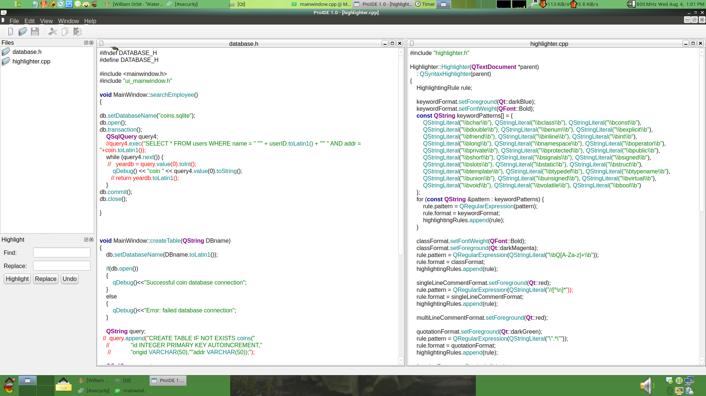

This is a GUI for iptables.

It will generate a bash script based on the user's modifications in the GUI. It can be exported to a remote server or executed locally.

 

todo - would like to see this thing ask for user permissions (zonealarm and, ebfsnitch for linux) both do this already

ide like to do the same things to gufw too. parse /var/log/firewall and get dropped packets from iptable rule

nftables are another thing to consider someone suggested.

i started this project because suse's persistant firewall problems have been around since the new yast gui in like 2000's even in 2021 its still not working very good you can try the iso's out for yourself and try to block any webtraffic.

would also like a version of this done in Irrlicht / SDL / and TK / plain bash
